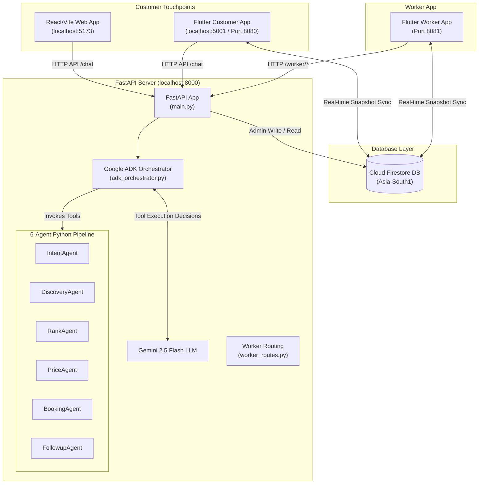
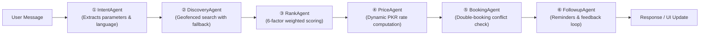

# HizmatAI (خدمت)

**A Two-Sided Agentic Home Service Booking & Management Ecosystem for Pakistan's Informal Economy.**

HizmatAI bridges the gap between Pakistani households and informal service providers (electricians, plumbers, AC technicians, cleaners, tutors, and beauticians) through a seamless trilingual conversational interface in **Urdu, Roman Urdu, and English**. 

Powered by a **6-agent Google ADK (Antigravity) pipeline and Gemini 2.5 Flash**, the system automates discovery, multi-factor ranking, dynamic pricing, double-booking conflict resolution, real-time tracking, and automated WhatsApp-style follow-ups.

---

## 🚀 Key Architectural Pillars

*   **Google ADK Orchestration:** Live execution of 6 collaborative agents (`IntentAgent`, `DiscoveryAgent`, `RankAgent`, `PriceAgent`, `BookingAgent`, `FollowupAgent`) coordinated autonomously by Gemini 2.5 Flash.
*   **Two-Sided Marketplace System:** 
    *   **Customer Side:** A Vite/React web client and a Flutter mobile/web app featuring natural chat booking, transparent AI trace panels, live worker trackers, and Stripe checkout.
    *   **Worker Side (NEW):** A Flutter mobile application for local service providers, featuring real-time job offer sheets, a single-tap timeline stepper, digital CNIC/profile onboarding, daily/weekly automated earnings dashboards, and schedule calendars.
*   **Real-Time Firestore Sync:** Eliminates complex WebSocket setups. The entire state of jobs, active chat, and worker positions syncs natively and bidirectionally using Firestore real-time listeners.
*   **Stripe Sandbox Checkout:** Full payment workflow integration for card payments, coexisting with cash-on-service, EasyPaisa, and JazzCash.
*   **Dual-Execution Architecture:** 
    *   **Backend Path:** User Input → FastAPI → Google ADK Orchestrator → 6 Python Agents → Response.
    *   **Client-Side Path (Zero API Key Demo):** User Input → `agentEngine.js` → 6 JS Agents running fully client-side in React.

---

## 🗺️ System Architecture



---

## 🤖 The 6-Agent Collaborative Pipeline

Every booking request is parsed, routed, and processed through six specialized agents. You can observe their detailed decision-making process live using the **Agent Trace Panel** in the UI.



### Agent Detailed breakdown

| # | Agent | Input | Operations & Decisions | Output |
|---|---|---|---|---|
| **1** | **IntentAgent** | Raw User Text | Parses Urdu script, Roman Urdu, and English; extracts `service_type`, `city`, `zone`, `urgency`, and `preferred_time`. Detects ambiguities to prompt clarification. | Structured JSON + Ambiguity Flags |
| **2** | **DiscoveryAgent** | Service + Zone | Performs Haversine distance geofenced scanning from provider lat/lng coords; implements cross-zone waitlist fallback if zero matches are found locally. | List of Candidate Providers |
| **3** | **RankAgent** | Candidates + Location | Applies a 6-factor weighted formula:<br/>*   Rating: **25%**<br/>*   On-Time Score: **20%**<br/>*   Completion Rate: **20%**<br/>*   Experience (Total Jobs): **15%**<br/>*   Certification Status: **12%**<br/>*   Hourly Rate: **8%** | Ranked Candidates with Scores |
| **4** | **PriceAgent** | Provider Coords + Urgency | Computes dynamic rate: `Base labor` (based on estimated hours) + `Flat PKR 200 visit fee` + `15% materials estimate` + `20% urgency fee` + `PKR 50/km beyond 5km` - `5% returning customer discount`. | Detailed Dynamic Price Quote |
| **5** | **BookingAgent** | Slot + Provider ID + Price | Performs transactional slot checks to guard against race conditions. Appends flat `PKR 99 platform fee` and `5% GST`. Generates unique transaction ref `HMZ-XXXXXXXX`. | Confirmed Booking Record |
| **6** | **FollowupAgent**| Booking Ref | Schedules automatic Urdu/Roman Urdu notifications (1 hour before, 15 min before, on completion) and simulates WhatsApp checkups. | Active Notification/Reminder Log |

---

## 💻 Feature Matrix

### 👤 Customer Features
*   **Trilingual AI Chat:** Natural language inputs like *"Bhai DHA phase 2 me ac repair ke liye koi bijli wala chahiye abhi"* are immediately parsed.
*   **Agent Trace Timeline:** Watch the thoughts, tools, and decisions of all 6 agents execute step-by-step in real time.
*   **Interactive Provider Picker:** View the top 3 ranked professionals with detailed breakdowns of their scoring card.
*   **Live Tracker & Stepper:** Track the status of the booking (*En Route*, *Arrived*, *In Progress*, *Completed*) as updated by the worker.
*   **Payment Sheets:** Stripe payment gateway integration with simulated support for JazzCash and EasyPaisa.
*   **Booking History:** Easy-to-view tab containing past service invoices, transaction receipts, and current statuses.

### 🛠️ Worker Features
*   **Secure Phone Auth:** Firebase-integrated phone verification ensuring passwordless registration and login.
*   **Provider Profile Onboarding:** Multi-step digital onboarding to configure CNIC, categories, area zones, customized hourly rate, and weekly availability calendars.
*   **Online/Offline Availability Toggle:** Simple switch in the app bar that instantly enables/disables the provider from the active matching algorithms in Firestore.
*   **Interactive Full-Screen Job Alerts:** Vibrating, audio-pulsed overlays for incoming jobs with details (pricing, zone, urgency, distance) and a 60-second auto-decline countdown.
*   **Milestone Stepper:** Easy buttons to notify the customer in one click (*I've Arrived*, *Start Work*, *Complete Job*).
*   **Milestone Photo Proof:** Camera capture requirements at key stages (*Arrived* for before photo, *Completed* for after photo) uploaded to the job's Firestore document.
*   **"Add Extra Work" Flow:** Request live approvals from customers for additional materials or work costs mid-service.
*   **Interactive Earnings Hub:** Interactive charts and summaries showing daily, weekly, and monthly net payouts (JazzCash/EasyPaisa) after platform fees.

---

## 📂 Project Structure

```
aihack/
├── src/                        React web app (Vite)
│   ├── agents/
│   │   ├── agentEngine.js      Client-side JS implementation of the 6 agents
│   │   └── backendApi.js       FastAPI communication wrapper & mapping shim
│   ├── components/             Vibrant UI components (ChatWindow, AgentTrace,
│   │                           BookingCard, ProviderPicker, PaymentSheet, etc.)
│   ├── firebase.js             Customer-side Firebase SDK configuration
│   └── App.jsx                 Main client routing, session management, tabs
│
├── hizmat_ai/
│   ├── backend/
│   │   ├── main.py             FastAPI Server and REST routes
│   │   ├── adk_orchestrator.py Google ADK LlmAgent setup & running loop
│   │   ├── agents.py           6 specialized Python agent definitions
│   │   ├── worker_routes.py    Worker endpoints (Accept/Decline, Profile, Earnings)
│   │   ├── haversine.py        Zero-cost geospatial calculation (no Maps API needed)
│   │   ├── providers.json      Mock provider template dataset
│   │   ├── seed_firestore.py   Initial Firestore seeding script for providers
│   │   └── requirements.txt    Python dependencies
│   │
│   ├── flutter_app/            Customer Flutter App
│   │   └── lib/
│   │       ├── features/       Onboarding, Agent Trace, Home Chat, Booking History
│   │       ├── services/       API client, Local Storage, Firebase setup
│   │       └── main.dart       Application startup & global routing
│   │
│   └── flutter_worker_app/     Worker Flutter App
│       └── lib/
│           ├── features/       Auth, Jobs loop, Active Timeline, Earnings dashboard, Schedule
│           ├── services/       AuthService, LocationService, FirestoreService, NotificationService
│           └── main.dart       Worker initialization & Firebase connection
```

---

## 🛠️ Getting Started & Installation

### 1. Prerequisites
Ensure you have the following installed on your system:
*   **Node.js** (v18+)
*   **Python** (v3.11+)
*   **Flutter SDK** (v3.22+)
*   **Google Gemini API Key**

---

### 2. Backend Setup
1. Open your terminal and navigate to the backend directory:
    ```bash
    cd hizmat_ai/backend
    ```
2. Install the required Python packages:
    ```bash
    pip install -r requirements.txt
    ```
3. Set your Gemini API key in a `.env` file:
    ```bash
    echo "GOOGLE_API_KEY=your_gemini_api_key_here" > .env
    ```
4. Place your Firebase private credentials file `serviceAccountKey.json` inside the `backend` folder.
5. (First-time setup only) Seed the Firestore database with the mock provider data:
    ```bash
    python seed_firestore.py
    ```
6. Start the FastAPI server on port 8000:
    ```bash
    uvicorn main:app --reload --port 8000
    ```
7. Verify the server is running by hitting the health check:
    ```bash
    curl http://localhost:8000/health
    ```

---

### 3. React Web App Setup
1. Return to the root directory:
    ```bash
    cd ../../
    ```
2. Install npm dependencies:
    ```bash
    npm install
    ```
3. Start the Vite dev server:
    ```bash
    npm run dev
    ```
4. Access the web app in your browser at `http://localhost:5173`. 
   *(Note: By default, the React Web App is fully functional without running a backend because the 6 agents run directly inside the browser's JavaScript environment as an instant offline demo! To hook it up to the FastAPI backend, see the settings panel in the app).*

---

### 4. Flutter Customer App Setup
1. Navigate to the customer app directory:
    ```bash
    cd hizmat_ai/flutter_app
    ```
2. Fetch Dart packages:
    ```bash
    flutter pub get
    ```
3. Launch the app on your preferred browser or device (Runs on Port 5001):
    ```bash
    flutter run -d chrome --web-port 5001
    ```

---

### 5. Flutter Worker App Setup
1. Navigate to the worker app directory:
    ```bash
    cd hizmat_ai/flutter_worker_app
    ```
2. Fetch Dart packages:
    ```bash
    flutter pub get
    ```
3. Launch the worker app (Runs on Port 8081):
    ```bash
    flutter run -d chrome --web-port 8081
    ```

---

## 🎯 Playbook: Edge Case Scenarios

HizmatAI contains pre-wired scenarios that you can trigger instantly via the **DemoBar** on the React Home Screen to test our robust handling of common informal economy edge cases:

*   **Scenario A: Double Booking Conflict**
    *   *Prompt:* `"Bhai DHA Phase 2 mein AC repair chahiye abhi"`
    *   *What happens:* The top ranked provider's calendar slot is artificially marked as blocked. `BookingAgent` immediately detects the conflict, flags it, and prompts the user with the next available slots or matches them with the second-best ranked alternative.
*   **Scenario B: Out-of-Zone Fallback**
    *   *Prompt:* `"G-13 Islamabad mein AC technician chahiye"`
    *   *What happens:* The system looks for an AC technician directly in G-13. Finding none, `DiscoveryAgent` expands its geofence range, identifies a provider in an adjacent zone, offers waitlist placement, and provides a clear notice of travel surcharge.
*   **Scenario C: Multilingual Ambiguity Resolution**
    *   *Prompt:* `"koi repair wala chahiye ghar mein"`
    *   *What happens:* `IntentAgent` recognizes the lack of a specific service category. Instead of guessing or failing, it identifies the language, suspends execution, and generates a polite, custom trilingual quick-reply menu asking whether they need an electrician, a plumber, or an AC technician.
*   **Scenario D: End-to-End Success Loop**
    *   *Prompt:* `"Electrician chahiye DHA mein, urgent hai"`
    *   *What happens:* The entire 6-agent pipeline runs sequentially, matches the top-rated local electrician, calculates a dynamic rush surcharge, creates a pending booking, and lists scheduled follow-up notifications.

---

## 🎨 Aesthetic Design System

The HizmatAI ecosystem is designed around high-contrast, premium, lightweight light morphism principles to provide gorgeous visuals while remaining highly legible under direct sunlight:

*   **Harmony Palette:**
    *   **Customer Side Primary:** `#00B894` (Mint Green - representing cleanliness, growth, and trust).
    *   **Worker Side Primary:** `#FF6B35` (Vivid Orange - representing energy, safety, and action).
    *   **Agent Accent Color:** `#6C5CE7` (Royal Purple - representing AI intelligence and processing depth).
    *   **System Background:** `#F6F7FB` (Warm Soft Off-white).
*   **Typography:** Google Fonts' **Poppins** (weights 300 to 800) for a modern, clean, and balanced interface.
*   **Touch Targets:** Scaled up to a minimum of **52dp** on the Worker App to accommodate easy outdoor usage, work gloves, or rough use conditions.
*   **Micro-Animations:** Fluid glassmorphism overlays, slide-up drawers, pulsing indicators for urgent jobs, and clean trace timeline card expansions.

---

## ⚙️ Real-World vs Simulation Matrix

HizmatAI is engineered to demonstrate complete functional depth while remaining incredibly fast and straightforward to run in a hackathon sandbox:

| Component | Status | Operational Detail |
|---|---|---|
| **Google ADK & Gemini** | **REAL** | Real-time structured tool calling and orchestrations powered by Gemini 2.5 Flash. |
| **Two-Sided Real-Time Sync**| **REAL** | Reactive UI updates across customers and workers handled natively through Cloud Firestore snapshots. |
| **Geospatial Distance** | **REAL** | Mathematical Haversine formula mapping lat/lng zones (zero API key or Google Maps costs). |
| **Stripe Checkout** | **REAL** | Live Stripe sandbox payment intent creations and security tokens. |
| **Mobile Auth Gateway** | **REAL** | Firebase SMS OTP logic for provider authentication. |
| **WhatsApp Messages** | **SIMULATED** | The `FollowupAgent` queues reminders and logs simulation traces (mocked to bypass Twilio API setup). |
| **Mobile GPS Updates** | **SIMULATED** | Manual zone toggles are provided on mobile to allow easy testing from a single desk. |

---

## 🏆 Rubric Alignment Matrix

| Evaluation Criteria | Weight | Implementation Details & Evidence |
|---|---|---|
| **Google ADK / Antigravity** | **25%** | Setup of `LlmAgent`, `Runner`, and context loops in `adk_orchestrator.py`. Autonomously determines agent order on the backend. Client-side alternative built inside `agentEngine.js` for instant testing. |
| **Agentic Reasoning** | **20%** | Multi-agent collaboration with reasoning. Detects incomplete requests, structures multi-turn dialogue memory, handles zone fallbacks, and outputs user-facing step-by-step transparency traces. |
| **Matching Quality** | **20%** | Evaluates candidate pools across 6 distinct weighted indices. Calculates complex dynamic PKR pricing with 5 separate surge and platform fee formulas. |
| **Action Simulation** | **15%** | Implements transaction boundaries for slot conflicts, simulated notifications, card capture, and live timeline milestones. |
| **Technical Implementation**| **10%** | Async FastAPI backend, Riverpod + GoRouter state machine on Flutter, persistent localStorage, Firebase integration, and complete Firestore security rules. |
| **Innovation & UX** | **10%** | Trilingual NLP support (native Urdu, Roman Urdu, and English). Stunning light morphism UI, dual-sided workflow layout, and an expandable Agent Trace panel. |

---

*Developed by **Syed Ahnaf Raza** · Bahria University Karachi · Google ADK Hackathon Submission*
